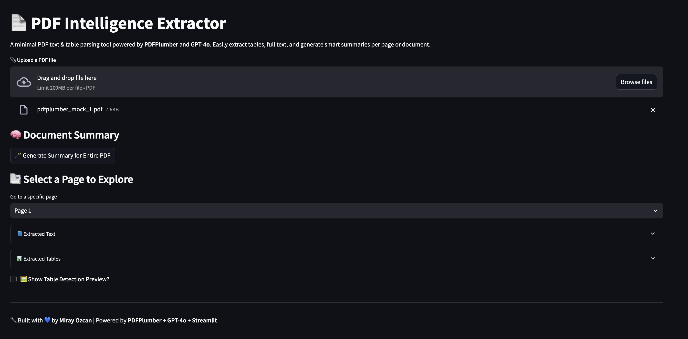
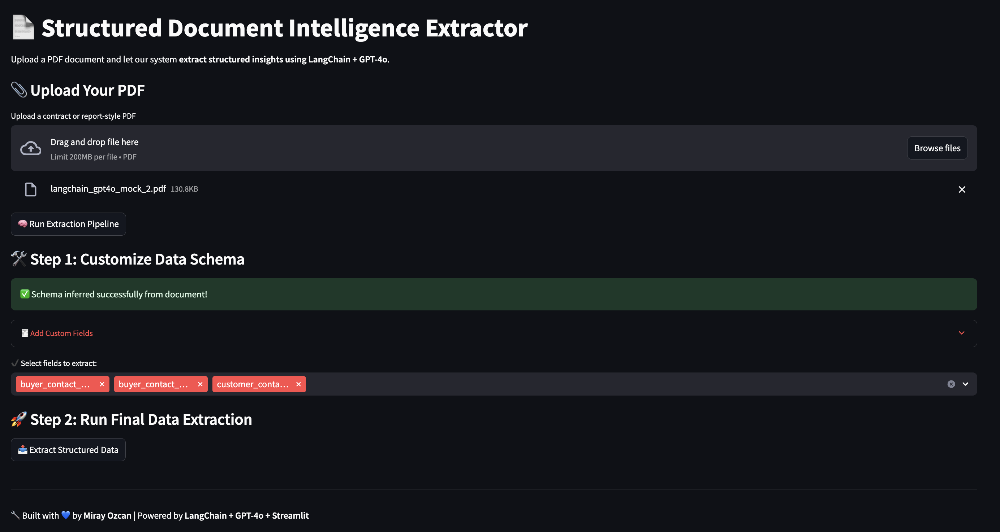
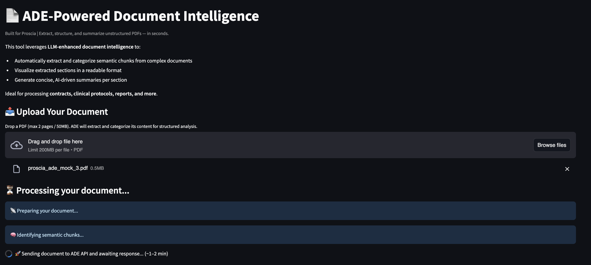

# 📄 Intelligent PDF Extractor Suite  
Built with 💙 by **Meet Patel** | Powered by **Streamlit + Gemini 3 Pro + Agentic Document Extractor + LangChain + PDFPlumber**

> **Solve real internal bottlenecks with AI.**  
> This multi-version toolset tackles one of the biggest pain points faced by product operations and cross-functional teams: **valuable business data trapped inside messy PDFs** like contracts, onboarding forms, invoices, or configuration summaries.  

---

## 🔧 Motivation

During my internship interview at **Motilal Oswal**, I  uncovered key internal pain points:

> ⚠️ _"The data often lives in PDFs we've signed with customers, but it's never made it into a spreadsheet that's queryable... It's scattered, manual, inconsistent, or siloed. If we could automatically pull structured info from these documents and present it cleanly, we'd save hours per deal."_  

This repo aims to **automate that transformation pipeline** — turning unstructured PDFs into structured, queryable, and exportable datasets with just a few clicks.

---

## 📸 Screenshots

### v0: Lightweight PDF Reader


### v1: LangChain Schema Extractor


### v2: ADE-Powered Chunk Viewer


---

## 🚦 App Versions Overview

| Version | Branch | Stack | Best For | Summary |
|--------|--------|-------|----------|---------|
| **v0** | `main` | `PDFPlumber + Gemini` | ✅ Quick prototyping<br>✅ Lightweight extractions<br>✅ Page-by-page summaries | Extracts raw text and tables from PDFs using `pdfplumber`, then summarizes via Gemini 3 Pro. Ideal for simple forms or multi-page review. |
| **v1** | `v1`   | `LangChain + GPT-4o` | ✅ Structured data schema<br>✅ Automating contract ingestion<br>✅ Extracting JSON records | Uses LangChain's document loader and schema detection to extract structured records with schema customization. Great for generating tabular insights from customer contracts. |
| **v2** | `v2`   | `Agentic Document Extraction (ADE)` | ✅ Formatted documents<br>✅ Contracts w/ visual structure<br>✅ Section-level summaries | Sends full PDFs to an external ADE API and groups semantic chunks into labeled sections. Excellent for internal PDF templates or procurement docs. |

---

## 🧠 Feature Comparison

| Feature | v0 | v1 | v2 |
|--------|----|----|----|
| Extracts Tables | ✅ | ✅ | ✅ |
| Extracts Raw Text | ✅ | ✅ | ✅ |
| Section-Based Summarization | 🚫 | ✅ | ✅ |
| Structured JSON Record Extraction | 🚫 | ✅ | 🚫 |
| Custom Schema Selection | 🚫 | ✅ | 🚫 |
| Full PDF Summarization | ✅ | 🚫 | ✅ |
| Export CSV | ✅ | ✅ | ✅ |
| Best For | Simpler docs | Tabular contract data | Long-form/styled PDFs |

---

## ▶️ How to Run

Each version lives in its own branch. Follow these steps to get started:

### 1. ⬇️ Clone the repo:
```bash
git clone https://github.com/ozcanmiraay/opsbot.git
cd opsbot
```

### 2. 🐍 Create and activate a virtual environment:
```bash
python3 -m venv venv
source venv/bin/activate     # macOS/Linux
# OR
venv\Scripts\activate        # Windows
```

### 3. 📦 Install required dependencies:
```bash
pip install -r requirements.txt
```

### 4. 🔐 Set up your API keys:

Create a `.env` file in the root directory with the following content:

```
GEMINI_API_KEY=your-gemini-api-key
ADE_API_KEY=your-agentic-doc-extraction-api-key
```

- Get your **Gemini API key** [here](https://aistudio.google.com/app/apikey)  
- Request access to the **Agentic Document Extractor API (ADE)** [here](https://support.landing.ai/landinglens/docs/visionagent-api-key)
  
---

## 🚀 Launch the App

### ⚙️ v0: PDFPlumber Text & Table Extractor
```bash
git checkout main
streamlit run app/streamlit_app.py
```

### 🧠 v1: LangChain Schema-Based Extractor
```bash
git checkout v1
streamlit run app/streamlit_app.py
```

### 🤖 v2: Agentic Document Intelligence Viewer
```bash
git checkout v2
streamlit run ui/streamlit_app.py
```

---

## 🧩 Real-World Use Cases

- **Contract Intelligence**: Pulling features, pricing, infrastructure specs, and deployment configurations from customer contracts.
- **Sales Enablement**: Exporting client configuration from PDFs into CRM fields automatically.
- **Internal Alignment**: Creating dashboards where executives and department leaders view only the data relevant to them.
- **Audit Readiness**: Summarizing past signed forms and validating consistency across regions.

---

## 🛠️ Tech Stack

- **LLM**: Gemini 3 Pro via `google-generativeai`
- **Document Parsing**: `pdfplumber`, `PyPDFLoader`, Agentic Document Extractor by LandingAI
- **Interface**: Streamlit
- **Helpers**: LangChain prompt pipelines, recursive chunking, CSV export, HTML table rendering

---